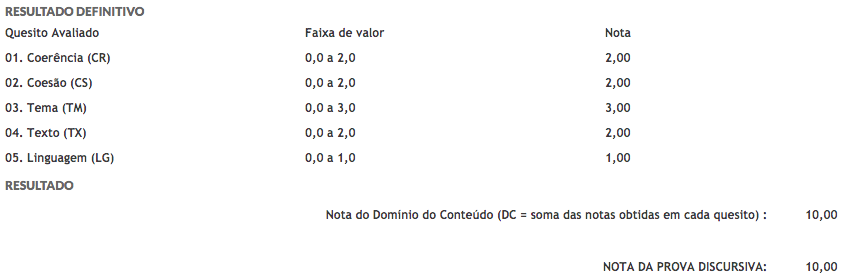
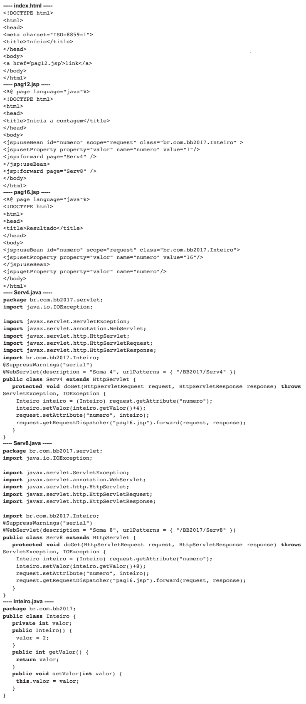

# Dicas gerais BRB

Edital IADES
https://www.iades.com.br/inscricao/upload/250/201905078135308.pdf

## Sobre a S/A

* Aproximadamente 200 funcionários de TI
* Desvio de função de escriturários
* Último concurso pessoal entrou com ação judicial - terceiros no lugar de Analistas
* NÃO usam GIT - SVN
* Denvolvimento em Windows
* Scrum começando
* Tecnlogias
  * IDE Base: Eclipse  
  * Angular + SpringBoot
  * CA API Gateway + WSO2
  * Maven + Jenkins
  * Builds em JavaScript com Gulp e Grunt
    * Webpack
  * PHP + Mysql
  * Oracle + SQL Developer
  * Delphi still lives
  * JavaEE 6 + JPA + JSF - automoção fóton
  * Sonar
  * Muito Cobol - empresa Spread
    * Lógica NÃO é somente COBOL: saldo na alta e baixa
* Docker + Kubernetes - início
  * Oracle + RedHat -> Open SHift
* Mobile em IONIC desenvolvido pela MBAMOBI
* PDTI BRB
  * metas PassA, Internalização da Alta
  * Meta para aumentar Certificados ITIL + COBIT

# Sobre o Edital

* REGIME JURÍDICO DOS SERVIDORES DO DISTRITO FEDERAL -  **Lei Complementar no 840/2011**
  * Por que se é um S/A e são contrados via CLT?

Edital da "NASA" - cobrando coisas muito antigas e muito novas

Sem NoSQL

Objetiva
* Conhecimentos Gerais - 20 pontos
* Conhecimentos Específicos - 60 pontos

Discursiva
* 80 redações corrigidas
* A prova discursiva receberá pontuação máxima igual a 20,00 (vinte) pontos.
  * < 6 == FORA
* A prova discursiva terá 2 (duas) questões e consistirá na elaboração de textos dissertativos e(ou) descritivos - 30 linhas
  
* PROVA DATAPREV 2014
  * 

* BB 2018
  * [Prova](https://arquivos.qconcursos.com/prova/arquivo_prova/57263/cesgranrio-2018-banco-do-brasil-escriturario-prova.pdf?_ga=2.44020647.30947078.1565139015-419187523.1534973860)
  * [Edital](https://arquivos.qconcursos.com/regulamento/arquivo/15442/banco_do_brasil_2018_escriturario-edital.pdf?_ga=2.82760724.30947078.1565139015-419187523.1534973860) 

## Sobre a banca

* Quais últimos concursos?

Apex 2018

CRF-TO 2019

* Alguns exemplos de questões

## Gestão

* PMBOK 6 - decorar as diferenças básicas

> (2018 - IADES - Apex) O Guia Project Management Body of Knowledge (PMBOK) define 10 áreas de conhecimento, entre as quais separa os processos. A respeito dessas áreas de conhecimento, é correto afirmar que o processo

A
“definir o escopo” pertence à área “qualidade”.
B
“encerrar o projeto ou fase” pertence à área “tempo”.
C
“gerenciar as comunicações” pertence à área “recursos humanos”.
D
“encerrar as aquisições” pertence à área “integração”.
E
“sequenciar atividades” pertence à área “tempo”.

## Fundamentos de Desenvolvimento

* Security By Design
* (Design Patterns)
  * https://brizeno.wordpress.com/padroes/
  * Criação X Estruturais X Comportamentais

> (2019 - INAZ) “Os padrões de projetos tornam mais fácil reutilizar soluções e arquiteturas bem-sucedidas para construir softwares orientados a objetos de forma flexível e fácil de manter.” 

Quais padrões de projeto são padrões de projeto comportamentais? 
A Command, Observer e Interator.
B Singleton, Visitor e State.
C Prototype, Adapter e Bridge.
D Memento, Builder e Mediator.
E Proxy, Singleton e Decorator.

> (2019-Cespe) O uso de design patterns leva à unificação dos códigos utilizados em diferentes aplicações que utilizem o mesmo padrão.

Fui de certa, mas errada!

## ENGENHARIA
* DevOps
  * Colocar uma questão devops aqui
* CMMI e MPS/BR. 7 Metodologias ágeis de desenvolvimento de sistemas: DevOps, Scrum, XP, Kanban, TDD, BDD, DDD e RUP.

> (2018-IADES-Apex) A metodologia Scrum possui alguns eventos regulares voltados a minimizar a necessidade de reuniões não definidas no próprio Scrum, como a reunião de planejamento do sprint, o Scrum diário ou a revisão do sprint. Em relação a essas reuniões, é correto afirmar que

A
o time de desenvolvimento, durante o planejamento do sprint, trabalha para prever as funcionalidades que serão desenvolvidas no decorrer do sprint.
B
as reuniões de planejamento do sprint são usualmente rápidas, com cada desenvolvedor respondendo a três perguntas rapidamente, sendo elas: o que foi feito ontem; o que será feito hoje; há algo o bloqueando?
C
o trabalho a ser realizado no sprint é decidido durante a revisão do sprint.
D
a reunião diária é realizada para adaptar o backlog do produto.
E
a revisão do sprint não tem autonomia para revisar o backlog do produto.

* Métricas de Software (3 questões no Conselho Regional de Farmácia)
  * Métricas Estáticas (sonar) X Dinâmicas (bugs)
  * LCOM, LOC, Complexidade ciclomática de código, Fan-In/Out

## LINGUAGENS e TECNOLOGIAS
* Velharias
  * Swing
  * WebServices - SOA

  * 1.4 SWT. 1.5 Eclipse. 
    * https://www.eclipse.org/swt/
  * 1.6 EJBQL (EJB 2)

* (2018 - Cesgranrio - BB)

Considerando-se que todos os links e referências estejam corretos, que o container utilizado é o Apache Tomcat 8, e que a versão de Java é 1.8.0_141, o resultado exibido por pag16.jsp quando o link presente em index.html for acionado será:

A 16

B 10

C 5

D 6

E 9

* Reflection API - nunca tinha visto cobrar
  * Vamos pra código
  
> (2017 - Vunesp) A forma como o código é compilado para a plataforma Java permite o uso de reflexão (reflection) sobre seus elementos. Tal recurso torna possível que

A
as classes de um tipo possam ser instanciadas como classes de outros tipos, indiscriminadamente.
B
as variáveis com conteúdos idênticos compartilhem o mesmo espaço de memória.
C
o código possa ser inspecionado, referenciado e invocado dinamicamente.
D
múltiplas instâncias do mesmo programa sejam carregadas uma única vez na memória.
E
a execução das tarefas de um programa seja distribuída em múltiplos processadores sem a necessidade do uso de threads.

> (2010 - Cesgranrio - Adaptada) Uma instituição financeira desenvolverá um novo sistema de informação WEB com base na plataforma Java EE 5. Os programadores devem ter ciência de que, na linguagem de programação Java e tecnologias relacionadas, NÃO é possível listar, por meio da Reflection API, que anotações foram colocadas em um parâmetro de um método.

Errada

## ARQUITETURA DE TECNOLOGIA DA INFORMAÇÃO.

* FrontEnd FORTE
  * Dar atenção especial ao Angular
  * JavaScript, HTML5, CSS3, WebSocket, Angular, Json, Rest e NPM
    * https://blog.caelum.com.br/rest-principios-e-boas-praticas/

> (2018 - BB) REST, ou Representational State Transfer, é um protocolo de comunicações sem estado.
>
> Que alternativa melhor representa o corpo de uma chamada REST que deseja saber o saldo de um cliente bancário identificado como cliente 23232?

A
{ cliente (id: "23232") { saldo } }}
B
{"cliente"=23232 "saldo"="?"}
C
http://app.banco.com/contascorrentes/saldo/cliente/23232
D
<QUERY><SALDO/><CLIENTE ID="23232"/><QUERY>
E
<?xml version="1.0"?> <soap:Envelope xmlns:soap=http://www.w3.org/2001/12/soap-envelope soap:encodingStyle="http://www.w3.org/2001/12/soap-encoding"> <soap:body> <b:getSaldo xmlns:b="http://app.banco.com/contascorrentes "> <m:cliente>23232</m:cliente></m:getSaldo> </soap:Body></soap:Envelope>

* JavaEE 7
  * http://blog.arungupta.me/javaee7-reference-card-dzone/
* JavaSE 8 - lambda
  * https://dzone.com/articles/functional-programming-patterns-with-java-8
  * https://blog.caelum.com.br/o-minimo-que-voce-deve-saber-de-java-8/
  * https://blog.caelum.com.br/java-8-lambda-ou-method-reference-entenda-a-diferenca/
  * https://blog.caelum.com.br/chega-de-nullpointerexception-trabalhe-com-o-java-util-optional/
  * https://blog.caelum.com.br/conheca-a-nova-api-de-datas-do-java-8/

  * Código?
    * Map and Reduce

* OpenID connect/Oauth2
* Servidores de aplicações Java como Jboss e Oracle Weblogic.
  * Pegar questão do TCU que cobra diferenciação entre Servlet Container X Web Server e App Server

## Tendências Novas
* Docker
  * https://dzone.com/asset/download/250347
  * Conteineirs Docker / OCI (Open Container Initiative)
    * https://containerjournal.com/2019/01/22/5-container-alternatives-to-docker/
    * Fazer um Hello World em Node
  * Kubernetes

> [By the year 2020](https://dzone.com/articles/kubernetes-vs-openshift-a-detailed-comparison?edition=515295&utm_source=Daily%20Digest&utm_medium=email&utm_campaign=Daily%20Digest%202019-08-10), more than 50% of companies will use container technology, up from less than 20% in 2017.

> 2018 -  COPERVE - UFSC A respeito da solução de contêiner Docker, analise as afirmativas abaixo e assinale a alternativa correta.

I. Uma imagem pode ser versionada com múltiplos commits.

II. O arquivo Dockerfile contém variáveis, comandos e/ou operações para criar uma nova instância Docker.

III. Depois de uma imagem ser criada, para alterá-la é necessário reexecutar o processo de criação.

> 2019 - Cespe - SLU-DF O Docker é uma ferramenta open source que permite a criação de ambientes virtuais por meio de Linux Containers, sendo uma das vantagens dos contêineres Docker fornecer uma virtualização em nível de sistema operacional, o que isola as aplicações em execução e não utiliza tantos recursos da máquina quanto as máquinas virtuais.

> 2019 - CCV-UFC Dockerfile é um um arquivo de texto que contém todos os comandos, em ordem, necessários para construir uma determinada imagem Docker. Sobre as instruções contidas em um Dockerfile, assinale a alternativa correta.

A.  A instrução VOLUME configura o tamanho da imagem.
B. A instrução ENV adiciona metadados para uma imagem.
C. A instrução WORKDIR permite a criação de um diretório no host onde ficam armazenados os dados do container.
D. A instrução EXPOSE informa ao Docker que o container escuta nas portas de rede especificadas em tempo de execução.
E. A instrução FROM configura qual será a aplicação principal do container, sendo executada após a inicialização do container.

* MicroServices
  * https://dzone.com/storage/assets/12278517-dzone-refcard215-microservices.pdf
  * https://microservices.io/patterns/microservices.html
  * https://blog.caelum.com.br/arquitetura-de-microservicos-ou-monolitica/

* Multitenancy
  * https://blog.caelum.com.br/um-produto-para-muitos-clientes-implementando-multitenancy/

> 2013 - Bacen- Multitenancy é uma importante característica da computação em nuvem que garante que cada usuário acesse recursos da nuvem de forma exclusiva.
>
>errada
 

## Conclusão

* https://dzone.com/refcardz
